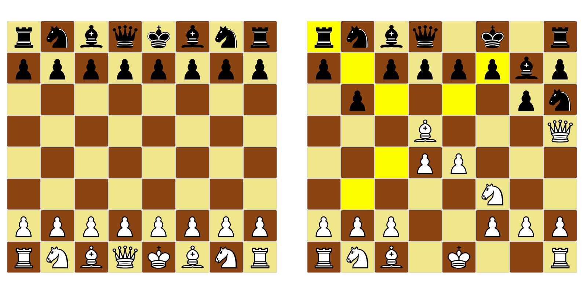

# Schachspiel

Ein einfaches graphisches Scachspielprogramm fuer zwei Spieler.

## Anforderungen

- Linux oder BSD basiertes System
- Gtk

## Installation

```
git clone https://github.com/mondokm/schachspiel.git
cd schachspiel
make compile
```

## UI

Das Programm hat ein graphisches UI, das wie ein Schachbrett aussieht.



Nach einem Klick auf einer Schachfigur werden die Trittmoeglichkeiten gelb gafaerbt. Falls der Spieler ein gelbes Feld klickt, wird der frueher ausgewaehlter Figur da treten, andernfalls wird der Auswahl zurückgenommen.

## Regeln

Der weißer Spieler fangt das Spiel an, die Spieler treten wechselweise. Rochade und Respawn sind schon nicht moeglich.

### Ende des Spiels

Das Spiel endet, wenn ein Spieler sein König verliert.